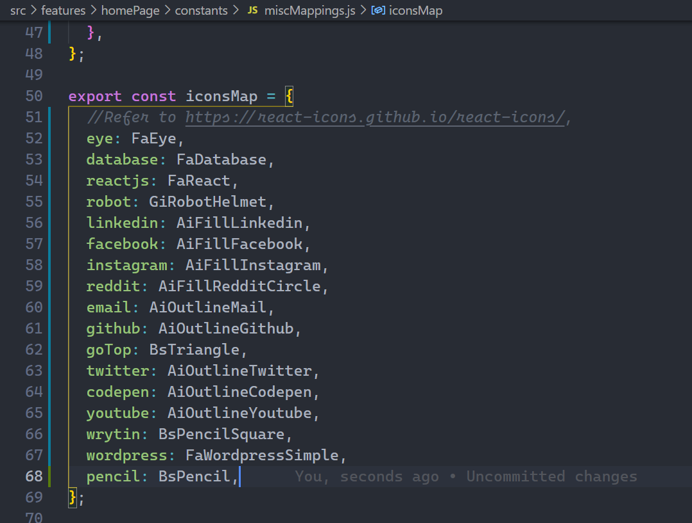

# SPIDEY-FOLIO (Create a Responsive React Portfolio that is Fully Customizable to your Needs)

[Demo](https://spideyfolio.web.app/)

Customize and create your Portfolio website and deploy it with the domain name of your choice without any hastles.

## Table of Contents

- [SPIDEY-FOLIO (Create a Responsive React Portfolio that is Fully Customizable to your Needs)](#spidey-folio-create-a-responsive-react-portfolio-that-is-fully-customizable-to-your-needs)
  - [Table of Contents](#table-of-contents)
  - [Setup Instructions](#setup-instructions)
  - [Begin your customization](#begin-your-customization)
    - [Updating Html File](#updating-html-file)
    - [Welcome Page Section](#welcome-page-section)
    - [About Section](#about-section)
    - [SkillSet Section](#skillset-section)
    - [Projects Section](#projects-section)
    - [Referrals Section](#referrals-section)
    - [Experience Section](#experience-section)
    - [Footer](#footer)
    - [NavBar Section](#navbar-section)
    - [Updating CSS and Themes](#updating-css-and-themes)
  - [Tools & Frameworks Used](#tools--frameworks-used)
  - [Deployment Instructions Using Firebase](#deployment-instructions-using-firebase)
  - [Updating Deployments](#updating-deployments)
  - [Credits Section](#credits-section)

## Setup Instructions

1. Clone the repository:
   `git clone https://github.com/spidey1405/spidey-folio`
2. Move into the repository:
   `cd spidey-folio`
3. Install the dependencies:
   `npm install` or `yarn install`
4. In order to ensure everything works:
   `npm run start` or `yarn start`

## Begin your customization

Now since we have checked that everything is working, let's begin your own customization:

### Updating Html File

You may want to start by fixing basic SEO and site settings by going to [index.html](public/index.html).
The Red highlighted areas are the ones you would want to change:


### Welcome Page Section

Here is where the actual customization begins. You either need to replace the existing image with the ones you have or you can rename the images in the respective files. To begin with go to [topHeader.js](src/features/constants/../homePage/constants/header/topHeader.js).


Note that there's a wiggly animation that happens when you hover to logo. If you don't want to keep that animation, you may need to comment hover part of logo animation from [components.module.scss](src/features/components/../homePage/components/TopView/components.module.scss).

### About Section

This Section is all about basic info about you.For making it look good, I have divided into two seperate sections. Note that starting from About section, all the way down, you have an option to show or hide section based on your requirements.


In order to customize about configuration, you should start with [sectionAbout.js](src/features/homePage/constants/body/sections/sectionAbout.js). Note that I have added a Linked-In connect button and you have the ability to customize the same, though the forward going arrow remains there, which can only be customized by directly going to the [code](src/features/homePage/components/Main/mappingFunctions/mappingAbout.js). In this code, you need to update line 46 in order to remove the arrow and replace it with something you're planning to use:


### SkillSet Section

Here you may want to add all your skills and expertise. For the icons, refer to [react icons](https://react-icons.github.io/react-icons) and choose whichever ones you're interested in using.


For configuring the icons, goto: [iconsMap function](src/features/homePage/constants/miscMapping.js). First you need to import the icons of your choice from the react icons page and then map it. Here's an example:

Suppose I want to use a pencil icon, so I go to [react icons](https://react-icons.github.io/react-icons/search) and search for pencil.

Now, out of all the results I choose to go with `BsPencil`:


The first two alphabets of icon denote where it is supposed to be imported from. In this case it's `bs`. So the import statement will be:

`import {BsPencil} from 'react-icons/bs;`

Now put in this line [miscMapping.js](src/features/homePage/constants/miscMapping.js):


Finally, you need to include the same with a key name say pencil into `iconsMap` function:


Once this all is done, now you can use the icon globally anywhere in the application you want using the same `getIcon` function.

### Projects Section


By now you would have got a good understanding of configurations. Here's the configuration file for [project section](src/features/homePage/constants/body/sections/sectionProjects.js). Additionally, I would like to add is that in this section, in `project descritption` which is a field of `back` key in project entity, the line break actually breaks into multiple paragraphs.

You may experience it yourself in development mode by testing and analyzing it. Additionally, there's nothing new in this section except for lots of customizations and stuff. Just to get your attention back to hiding an entire section, you may use: `showSection` as false in order to take down that entire section from your portfolio.

### Referrals Section


Here you can add some of the best references that you have recieved from colleagues, collaborators, and other professionals you have worked with. To begin editing this section, you may start from [sectionReferences.js](src/features/homePage/constants/body/sections/sectionReferences.js)

### Experience Section


Here you can add up all of your professional experiences, co-curricular, internships, etc. To edit this section goto: [sectionExperiences.js](src/features/homePage/constants/body/sections/sectionExperiences.js)

### Footer


In the Footer File, You may add as many social links as you want in addition to a specific footer message. All the footer files can be edited [here](src/features/homePage/constants/footer.js).

### NavBar Section

A Splashing NavBar Section is also included for smooth navigation which can be edited in `navItemsHeader` function in the file [miscMappings.js](src/features/homePage/constants/miscMappings.js) function.

### Updating CSS and Themes

For updating the CSS, you may try tweaking [global css folder](src/global_css/).
Here you have all the commonly used [variables](src/global_css/variables/_variables.scss), [animations](src/global_css/mixins/_animations.scss), [mixins](src/global_css/mixins/_mixins.scss) (for responsiveness) etc.

## Tools & Frameworks Used

- React JS
- Node Sass (For using SCSS)
- React Icons (For using ready to use Icons)
- Redux Toolkit (In case you're looking to expand this beyond a portfolio and maybe want to add state management and related stuff)

## Deployment Instructions Using Firebase

Deployment can't get more easy with firebase. The best part is that it gives you the domain of your choice. (with an extension of `web.app`) Here's simple instructions to get your site up and running within minutes with firebase:

Once you're satisfied with your development server go ahead and build the script files using:
`npm run build` or `yarn build`


Now we need to use firebase command line tools. Make sure you have firebase-cli installed by using following command:

Note that we're doing a global installation so that this package can be useful for your other deployment projects as well.

`npm install -g firebase-tools`

once the installation is done, login to your firebase using cli:
`firebase login`
In case you're already logged in and want to login from a different account use:
`firebase login --reauth`

once login is done, go ahead and initialize the firebase project as shown below:
`firebase init`

It will ask you for project configurations, give it an id (note that id is what will appear on your domain as well so be very very sure before inputting that. In case you choose an id which is already existing, then you have to do some tweaks within the same id, like for example: `spideyfolio` is unavailable, then maybe I would go with `spidey-folio`)

Here's how to procceed with configuration:

```
? Are you ready to proceed? Yes
? Which Firebase features do you want to set up for this directory? Press Space to select
features, then Enter to confirm your choices. Hosting: Configure files for Firebase Hosting and (optionally) set up GitHub Action deploys
=== Project Setup

First, let's associate this project directory with a Firebase project.
You can create multiple project aliases by running firebase use --add,
but for now we'll just set up a default project.

? Please select an option: Create a new project
i  If you want to create a project in a Google Cloud organization or folder, please use "firebase projects:create" instead, and return to this command when you've created the project.
? Please specify a unique project id (warning: cannot be modified afterward) [6-30 characters]:
 spideyfolio
? What would you like to call your project? (defaults to your project ID) spideyfolio
√ Creating Google Cloud Platform project
√ Adding Firebase resources to Google Cloud Platform project

=== Your Firebase project is ready! ===

Project information:
   - Project ID: spideyfolio
   - Project Name: spideyfolio

Firebase console is available at
https://console.firebase.google.com/project/spideyfolio/overview
i  Using project spideyfolio (spideyfolio)

=== Hosting Setup

Your public directory is the folder (relative to your project directory) that
will contain Hosting assets to be uploaded with firebase deploy. If you
have a build process for your assets, use your build's output directory.

? What do you want to use as your public directory? build
? Configure as a single-page app (rewrite all urls to /index.html)? Yes
? Set up automatic builds and deploys with GitHub? No
? File build/index.html already exists. Overwrite? No
i  Skipping write of build/index.html

i  Writing configuration info to firebase.json...
i  Writing project information to .firebaserc...

+  Firebase initialization complete!
```

Once the initialize is complete, you're ready to deploy the website using the command:
`firebase deploy`

```
=== Deploying to 'spideyfolio'...

i  deploying hosting
i  hosting[spideyfolio]: beginning deploy...
i  hosting[spideyfolio]: found 71 files in build
+  hosting[spideyfolio]: file upload complete
i  hosting[spideyfolio]: finalizing version...
+  hosting[spideyfolio]: version finalized
i  hosting[spideyfolio]: releasing new version...
+  hosting[spideyfolio]: release complete

+  Deploy complete!

Project Console: https://console.firebase.google.com/project/spideyfolio/overview
Hosting URL: https://spideyfolio.web.app
```

This message ensures that your deployment was successful. Additionally please make sure you move out [readme images folder](public/web/readme_instructions) to reduce your bundle size, or you can delete it directly from `build/web/readme_instructions` after the build process is done.

## Updating Deployments

Each time you want to update the deployment, you need to rebuild your scripts and run `firebase deploy`. It's that simple 😉

In case you liked this project template and found this guid useful don't forget to star the repository. It will mean a lot to me. Additionally. if you have any feedback or upgrades you want to propose feel free to add merge requests.

## Credits Section

- AppBrewery: Web Development Bootcamp
- Academind: Complete ReactJS Guide
- ZTM: Complete Web Development BootCamp
- Jonas Schmedtmann: Advanced CSS and Sass

This project itself was a lot of learning for me. I have been getting into so many things understanding their implementation before coming up with this. Here's a shoutout to those who played a huge role in building this project. Startin from [Appbrewery's Web Development Bootcamp](https://www.udemy.com/course/the-complete-web-development-bootcamp/) where I was first introduced about web development and it's overall working. I loved the way Angela teaches and puts in so much of effort in making subject fun and interesting to understand.

After getting a gist of webdev, I realized how cool is `React JS` and so I moved to learning it at an Advanced level from [React - The Complete Guide](https://www.udemy.com/course/react-the-complete-guide-incl-redux/) where I understood so many amazing concepts about React JS. Starting from the classes to functions, hooks, higher order components, error handlers, react routers, authentications, etc. I loved the way Max breaks super complex problems into super simple easy to implement solutions. Especially when doing the state management. And not to forget organizing files, design patterns are something which I was really able to grasp the best in this course.

Finally after getting fairly comfortable in React, one of my friends suggested me to also try [ZTM Complete WebDev Bootcamp](https://www.udemy.com/course/the-complete-web-developer-zero-to-mastery/) and I am so thankful that he did. What's so special about `ZTM` courses is that they Andrei focusses so much on not just teaching the core concepts but also how you can use your projects to make a difference, to how you can use what you learn for the open source community, how you should go about after learning something and so much. Though all of the courses I have taken till now did make a huge impact in deciding to create my first open source project, but Andrei has even deeper influence about how to contribute to open source.

And last but not least, I would like to have a special mention to [Jonas Schmedtmann's Advanced CSS and Sass: Flexbox, Grid, Animations and More!](https://www.udemy.com/course/advanced-css-and-sass/). Spidey Portfolio's design is very much inspired by his `Natour's Project` design and I highly recommend you all to check out his Advanced CSS Course.

I always felt that there's a special thing that is missing in my webdev experience, when you go through so many different concepts and when you try to make a great website this miss always bugged me, I was not sure what it was unless I realized how much I struggled with css.

CSS itself has so much in it and to fill out that void, I enrolled in this amazing course and I am so glad that I did. In all of the web dev courses, you learn a lot of concepts, but CSS is something which I found to be missing. And it's for valid reasons, those courses aren't centered towards CSS yet they teach you a lot about responsive design. Since this course was specifically focussed towards CSS, I was able to deep dive into it and learn a lot of advanced CSS concepts and used them right away in my spideyPortfolio project.
